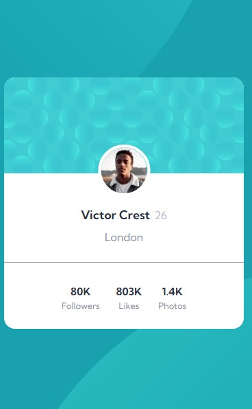
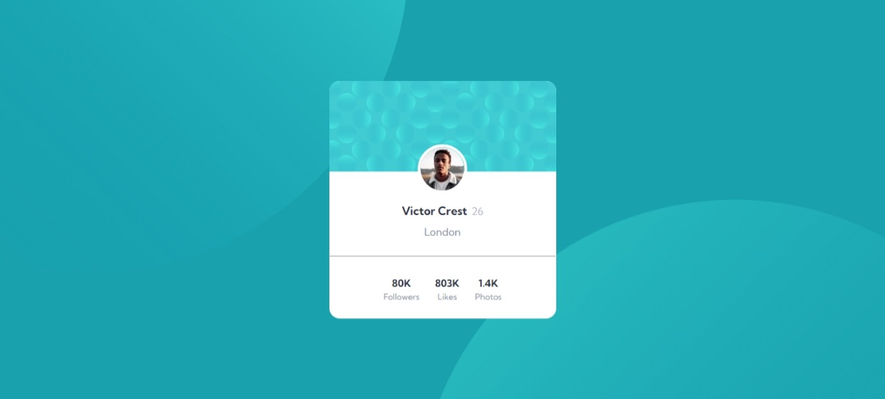

# Frontend Mentor - Profile card component solution

This is a solution to the [Profile card component challenge on Frontend Mentor](https://www.frontendmentor.io/challenges/profile-card-component-cfArpWshJ). Frontend Mentor challenges help you improve your coding skills by building realistic projects. 

## Table of contents

- [Overview](#overview)
  - [The challenge](#the-challenge)
  - [Screenshot](#screenshot)
  - [Links](#links)
- [My process](#my-process)
  - [Built with](#built-with)
  - [What I learned](#what-i-learned)
- [Author](#author)
- [Acknowledgments](#acknowledgments)

## Overview

### The challenge

- Build out the project to the designs provided

### Screenshot

### Links

- Solution URL: [solution URL](https://www.frontendmentor.io/solutions/profile-card-component-using-flexbox-Wcv7sZKpQ1)
- Live Site URL: [live site URL](https://cooger17.github.io/profile-card-component-main/)

## My process

### Built with

- Semantic HTML5 markup
- CSS custom properties
- Flexbox
- CSS Grid
- Mobile-first workflow

### What I learned

how to use more than one background image, and how to position them

## Author

- Frontend Mentor - [@cooger17](https://www.frontendmentor.io/profile/cooger17)

## Acknowledgments

thanks to [@vanzasetia](https://www.frontendmentor.io/profile/vanzasetia), he inspired me to deal with background position.
